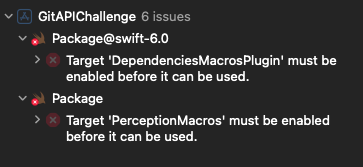
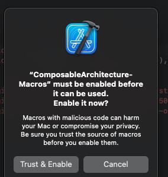

# GitAPIChallengeApp

# Setup

O projeto não utiliza nenhum gerador de projeto. Basta abrir o **Workpace** `GitAPIChallenge.xcworkspace`.

A medida de o XCode resolve o gráfico de dependências, você deverá se deparar com um alerta no "issue navigator" à esquerda. O Xcode perde autorização de confirmação de segurança para utilizar os macros da biblioteca [swift-composable-architecture](https://github.com/pointfreeco/swift-composable-architecture.git).

Exemplo:

Ao clicar em um dos alertas, esse diálogo irá pedir autorização dos macros "Trust & Enable".

Após conceder a autorização basta rodar o aplicativo utilizando o scheme `GitAPIChallenge`. 

### Tests
Para rodar os testes, acesse a aba "Test Navigator" e execute os testes do test plan "GitAPIChallenge.xctestplan".

# Arquitetura
Desenvolvimento em três camadas: Presentation (View/Feature), Domain (Repository) e Data (DataSource). As camadas definem uma separação clara de responsabilidade entre a construção da view, a construção do modelo de dados e como os dados são buscados. Uma camada de Networking alimenta DataSources em chamadas HTTP.

## Comunicação entre camadas
Desenvolvida a comunicação entre camadas com Swift Concurrency `async/await`. A comunicação utilizando async/await combina a eficiência de uma solução pura em Swift com a legibilidade da concorência estruturada (`async/await`).

`Combine`: Enquanto a aplicação não é alimentada por Combine, um exemplo de implementação está disponível para uso na camada de Networking (`HTTPClient`).

# Modularização (SPM)
A modularização auxilia no desenvolvimento de aplicações escaláveis e clara separação de módulos. A seguir veremos o que cada módulo implementa.

## AppUI: Para components de UI (desenvolvido com SwiftUI)
Componentes de UI pequenos, como também alguns mais complexos (ex. `AsyncImageCached`), podem ser encontrados  aqui. Aulixiares de UI também são definidos aqui, como `CustomColor` ou `Localized` (para facilitar a definição de uma string localizada).

Alguns components de exemplo:

- `AsyncImageCached` disponibiliza um componente que busca uma imagem de forma assíncrona evitando a interrupção da experiência do usuário. O componente provê uma experiência mais fluida ao garantir carregamento de imagens mais rápidas e evitar requests desnecessários (não obstruindo o endpoint).

- `WebView` implementa uma solução de uma `WKWebView` que é capaz de realizar callbacks de estados de uma `WKNavigationDelegate` através de uma `WebViewPhase` que garante uma experiência "native-like" ao uso de componente customizado.

## AppCore
É o que alimenta a aplicação pois define dependências de Networking, assim como camada de dados e domínio para regras de negócio. É definido pelas camadas mais internas da "Clean Architecture". Tipicamente pode ser definido por `DataSources` (APIs) e `Repositories`.

## AppFeatures
Multiplos targets e produtos definem cada Feature. Uma feature é desenvolvida com SwiftUI para criar um fluxo de views consistente que entregam valor ao usuário.
        
- As view são alimentadas por TCA (The Composable Arquitecture) para definir uma separação clara entre responsabilidade entre view e regras de negócio/apresentação. TCA também garante testabilidade da view através da simução de ações sem preocupar com dependências externas.

### Localization
Uma Feature é localizada através da inclusão de seu próprio arquivo de localização em módulo. Boas prática do desenolvimento definem que cada Feature terá seu próprio arquivo de localização e uma função não pública Localized para buscar a string em seu próprio módulo.

## Caching
Presente em "AppFoundation" está o cache responsável por realizar o Cache de dados através do NSCache. Caso desejado, um cache pode ser criado com diferentes políticas de limite de armazemaneto.

# Bibliotecas
Buscando simplificar o desenvolvimento e evitar a utilização de demasiadas bibliotecas externas que afetaria tempo de build e potenciais conflitos futuros de versionamentos, limitei o uso a apenas três bibliotecas externas.

1) [swift-composable-architecture](https://github.com/pointfreeco/swift-composable-architecture.git)

The Composable Architecture (TCA) alimenta toda a construção de lógica na criação de View. Ela garante uma separação de responsabilidades única ao simplificar uma lógica de estado centralizado que são atualizados através de ações, que por sua vez podem ativar outras ações assincronas ou não. Tudo isso é simplificado para o desenvolvedor através de um Reducer que expõe um enum com todas as ações. O TCA conta com diversos checks de segurança que garantem a integridade e previsibilidade de fluxo. Além disso a testabilidade do TCA se prova bastante eficaz e segura através de uma API de teste disponibilizada pela própria biblioteca. Apesar de exigir uma curva maior de aprendizado, é uma solução completa para aplicações de grande porte.

2) [swift-snapshot-testing](https://github.com/pointfreeco/swift-snapshot-testing.git)

Essa biblioteca é essencial nos testes de View. Capaz de detectar qualquer mudança em uma View através de comparação de Snapshots, ela garante consistência e previsibilidade de layout. Portanto, é essencial para uma aplicação que queira se preocupar com cada detalhe da experiência visual do usuário.

3) [CwlPreconditionTesting](https://github.com/mattgallagher/CwlPreconditionTesting.git)

Capaz de detectar `fatalError` esse biblioteca é essecial para testar cenários de crash e garantir que estão ocorrendo nos lugares corretos e detectar falhas no desenvolvimento.
